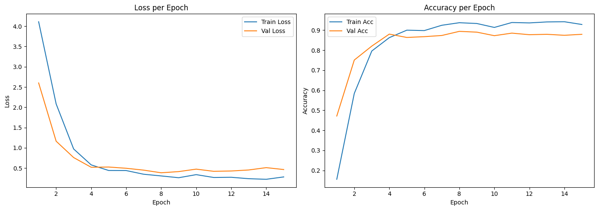
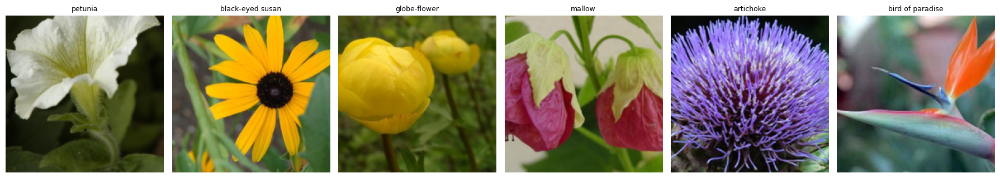

# Flowers102 EfficientNet Classifier

[](https://colab.research.google.com/github/arielshakaramiro/flowers102-efficientnet-classifier/blob/main/notebook/flowers102_efficientnet_classifier.ipynb)
[](LICENSE)

A transfer-learning image classifier for the [Oxford Flowers 102](https://www.robots.ox.ac.uk/~vgg/data/flowers/102/) dataset (102 flower categories), built with **PyTorch** and an **EfficientNet-B1** backbone pretrained on ImageNet. Includes a full training/evaluation notebook and a **FastAPI** serving script for real-time inference.

## Results

All numbers below come from an actual GPU run of the training notebook (Google Colab), not estimates. Full per-class breakdown is in the notebook.

| Metric | Value |
|---|---|
| Best validation accuracy | 89.41% (epoch 8/15) |
| Test accuracy (6,149 held-out images) | 87.95% |
| Test precision (weighted) | 89.76% |
| Test recall (weighted) | 87.95% |
| Trainable parameters | 130,662 (classifier head only) |
| Total parameters | 6,643,846 |



Validation accuracy peaks around epoch 8 and drifts slightly afterward — mild overfitting on a fairly small training split (1,020 images across 102 classes). This is why the best checkpoint (`best.pt`), not the last one, is used for evaluation and serving.

Per-class performance is uneven: several classes reach precision/recall of 1.00 (e.g. *bird of paradise*, *black-eyed susan*), while a few harder or visually similar classes score much lower (e.g. *mallow* precision 0.41, *japanese anemone* recall 0.46). The weighted averages above hide this spread — see `docs/results.json` and the notebook's classification report for the full picture.



## Dataset

M-E. Nilsback and A. Zisserman, *"Automated Flower Classification over a Large Number of Classes"*, Indian Conference on Computer Vision, Graphics and Image Processing, 2008. The notebook downloads the dataset directly from the official source and uses the paper's original train/val/test split (`setid.mat`) for reproducibility.

Class name mapping (index → flower name) is fetched at runtime from a well-known public reference (`cat_to_name.json`) rather than hand-typed, after an earlier manually-transcribed list was found to contain 104 entries instead of 102 during verification.

## Project structure

```
.
├── notebook/
│   └── flowers102_efficientnet_classifier.ipynb   # training + evaluation, GPU-verified
├── serving/
│   └── main.py                                    # FastAPI inference endpoint
├── docs/
│   ├── training_curves.png
│   ├── sample_images.png
│   └── results.json
├── requirements.txt
└── LICENSE
```

## Setup

```bash
pip install -r requirements.txt
```

## Training

Open `notebook/flowers102_efficientnet_classifier.ipynb` in Google Colab (GPU runtime recommended) and run all cells. It will:

1. Download the Oxford Flowers 102 dataset and official split.
2. Fetch the class name mapping.
3. Fine-tune the classifier head of a pretrained EfficientNet-B1.
4. Track loss/accuracy/precision/recall per epoch and save `checkpoints/best.pt` and `checkpoints/last.pt`.
5. Evaluate on the held-out test set and print a full classification report.

Model weight files are gitignored — after training, `checkpoints/best.pt` will exist locally but is not committed to this repo.

## Serving

```bash
uvicorn serving.main:app --reload
```

```bash
curl -X POST "http://localhost:8000/predict/" -F "file=@path_to_your_image.jpg"
```

Response:

```json
{"predicted_class": "sunflower", "confidence": 0.93}
```

The serving script uses the exact same preprocessing pipeline and model architecture as training — a mismatch in either is the most common cause of silently wrong predictions in transfer-learning projects like this one.

## License

MIT — see [LICENSE](LICENSE).
